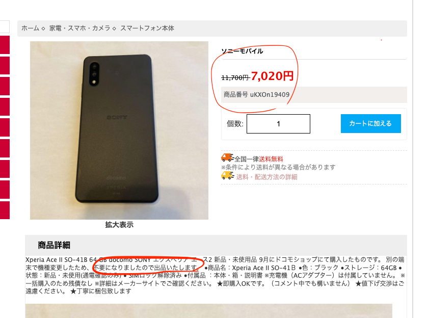
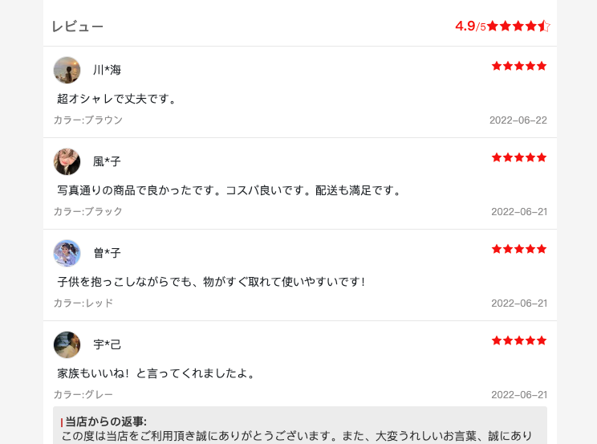
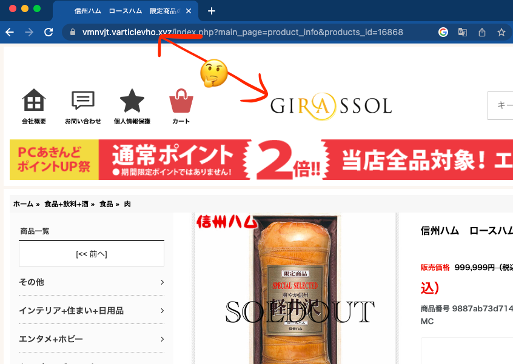
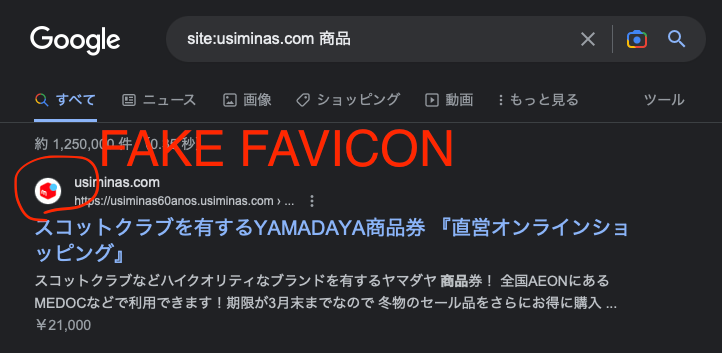

# uBlacklist-scam-net-shops

## Synopsis

Found a net shop offering goods at a ridiculously low price?
Watch out for the scam! 
バカみたいに安い商品をネットショップで見かけましたか？
詐欺に気をつけて！

- [消費者庁 - インターネット通販トラブルインターネット通販トラブル](https://www.caa.go.jp/policies/policy/consumer_policy/caution/internet/trouble/internet.html)
- [「届くのは粗悪品」謎の通販サイト◆ＳＮＳで拡散、発送元を追跡取材【時事ドットコム取材班】](https://www.jiji.com/jc/v8?id=202204soakuhin-team)

By subscribing this list with [uBlacklist](https://github.com/iorate/uBlacklist),
you can exclude such suspicious net shops, from search results, that might be a scam:
They probably do not deliver the goods you ordered, or deliver a cheap knock-off. 
このリストを [uBlacklist](https://github.com/iorate/uBlacklist) で購読すれば、怪しいネットショップを検索結果から除外できます。
奴らは商品を発送しないか、あるいは安いコピー品を発送するかもしれません。

Since the author is a Japanese, this list covers mainly sites written in Japanese,
but happy to include other suspicious sites in other languages. 
作者は日本人なので、このリストは主に日本語のサイトを対象にしていますが、他の言語での怪しいサイトを追加するも歓迎します。

## Example of Scum Net Shops

| image                            | Japanese description                                                   | English description                                                                                                                                                                                   |
|----------------------------------|------------------------------------------------------------------------|-------------------------------------------------------------------------------------------------------------------------------------------------------------------------------------------------------|
|  | <li>やけに安い</li><li>「〜〜で購入しました」などと中古品のような説明。おそらくメルカリやヤフオクなどからの無断転載。</li> | <li>Overly discounted</li><li>The description of the item is as if it were a used item, such as "I bought it at ..." etc. Probably an unauthorized reproduction from Mercari or Yahoo! Auctions.</li> |
|  | <li>奇妙な名前のユーザーによるレビュー</li>                                             | <li>Reviews by strange names </li>                                                                                                                                                                    |
|  | <li>ドメイン名とサイト名があまりに違う</li><li>ネットショップとして不自然なドメイン</li>                  | <li>Mismatch between domain name and site name</li><li>Domain name is not natural for a net shop.</li>                                                                                                |                                                                                                                                                                                                      
|  | <li>偽のファビコンを使い、メルカリなど有名サイトのふりをしている</li>                                | <li>Using a fake favicon, pretending to be famous sites like Mercari.</li>                                                                                                                            |

## Usage

1. Install uBlacklist. uBlacklist をインストールします。
    - [Chrome Web Store](https://chrome.google.com/webstore/detail/ublacklist/pncfbmialoiaghdehhbnbhkkgmjanfhe)
    - [Firefox Add-ons](https://addons.mozilla.org/en-US/firefox/addon/ublacklist/)
    - [Apple App Store](https://apps.apple.com/jp/app/ublacklist-for-safari/id1547912640)

2. Open the uBlacklist configuration, and then click "Add a subscription". uBlacklist の設定を開き、"Add a subscription"
   をクリックします。

3. Add `https://raw.githubusercontent.com/exoego/ublacklist-scam-net-shops/master/uBlacklist.txt` in the dialog. 
   ダイアログに `https://raw.githubusercontent.com/exoego/ublacklist-scam-net-shops/master/uBlacklist.txt` を追加します。

## Contribution

Check [CONTRIBUTING.md](CONTRIBUTING.md)
and [edit this file](https://github.com/exoego/ublacklist-scam-net-shops/edit/master/uBlacklist.txt).

## Acknowledgements

- [irotate/uBlacklist](https://github.com/iorate/uBlacklist) for the exceptional browser extension
- [消費者庁 悪質な海外ウェブサイト一蘭](https://www.caa.go.jp/policies/policy/consumer_research/international_affairs/assets/consumer_research_cms209_230224_01.pdf)

## License

[Creative Commons Zero v1.0 Universal](LICENSE)
